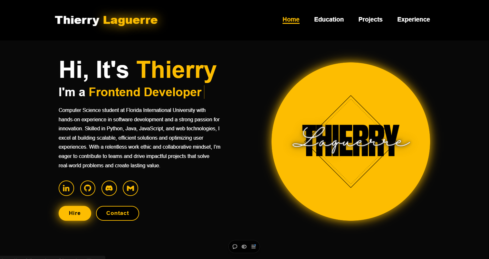

# 🙋‍♂️ **Hi, I'm Thierry!** 👋

Welcome to my personal website! 🎉  
Here, you’ll find everything about me — from my educational background 🎓 to my professional experience 💼, exciting projects 🛠️, and much more. Let’s dive in! 🌟

## 🏫 **Education**  
I’m passionate about computer science, and I’ve worked hard to hone my skills. Here's a peek into my academic journey:

- **Florida International University Honors College**, Miami, FL  
  - **Bachelor of Arts in Computer Science** (4.0 GPA)  
  - Expected Graduation: April 2026  
  - Relevant Coursework: Data Structures, Algorithms, Advanced Programming

- **Miami Dade Honors College**, Miami, FL  
  - **Associate of Arts in Computer Science** (4.0 GPA)  
  - August 2022 – April 2024  

## 💼 **Experience**  
I've had the pleasure of contributing to cutting-edge projects and gaining real-world experience in software engineering. Here's a snapshot of my professional journey:

### **Software Engineer | MyBonum**, Miami, FL  
*September 2024 – Present*  
- Engineered and optimized a high-performance web platform serving 75,000+ daily active users, maintaining 99.9% uptime and enhancing user engagement.
- Designed and implemented reusable front-end components, accelerating feature delivery timelines by 30%.
- Standardized UI elements across the platform, reducing visual inconsistencies by 10% and improving the overall user experience.
- Led performance optimizations, improving page load speeds by 20% and reducing server response times by 15%.

### **Software Engineer Intern | Food & Drug Administration**, Rockville, MD  
*June 2023 – August 2023*  
- Strengthened database security by integrating Microsoft Office tools, resulting in a 30% reduction in privacy risks and increased data protection.
- Developed dynamic data dashboards using Power BI, improving decision-making speed by 10% and enhancing data accessibility for stakeholders.
- Optimized search and authorization processes, cutting data retrieval times by 50% and improving system efficiency.

### **Software Engineering Intern | Miami Ed Tech**, Miami, FL  
*July 2021 – August 2021*  
- Designed and implemented interactive quizzes that boosted user engagement by 10%, improving retention on educational platforms.
- Applied SEO strategies, resulting in a 10% increase in website traffic and enhanced content visibility.
- Led usability testing and user feedback sessions, optimizing course navigation and improving user satisfaction by 25%.

## 🛠️ **Projects**  
I’m passionate about building innovative solutions. Here are a few projects I’ve worked on:

### **Real-Time Crypto Dashboard | Online Course Project | GitFront**  
*August 2024 – November 2024*  
- Built a real-time cryptocurrency dashboard using React, enhancing the data refresh rate by 15% and improving responsiveness.
- Implemented React Router for seamless page transitions, reducing page load times by 20% and enhancing user experience.
- Optimized data fetching with Axios, ensuring 99% accuracy in real-time data updates and increasing system reliability.

### **AI-Powered Customer Service App | HeadStarter AI Project | GitFront**  
*July 2024 – September 2024*  
- Developed a responsive customer service application using JavaScript and Next.js, increasing support access by 40% and reducing response times.
- Integrated OpenRouter API to improve query handling, cutting response times by 30% and enhancing the overall support process.
- Designed an intuitive UI with Material UI, reducing navigation time by 25% and improving user interactions.

### **Card Funding Dashboard | CodePath Open Source Project | GitFront**  
*July 2024 – August 2024*  
- Built a dashboard to track underfunded/overfunded card displays, improving decision-making accuracy by 95% and optimizing resource allocation.
- Developed JavaScript functions for donor data tracking, ensuring 99% accuracy in under 3 seconds.
- Enhanced the UX/UI for accessibility, leading to a significant improvement in user satisfaction and engagement.

## 🧑‍💻 **Skills**  
- **Programming Languages:** Proficient in Python (2 years), Java (1 year), HTML (4 years), CSS (4 years), Intermediate JavaScript (2 years) 💻  
- **Software & Tools:** React, NodeJS, NextJS, Flask, Bootstrap, REST API, Material UI, Google Cloud, Firebase, AutoCAD, Stripe CLI, Azure, JIRA, SQL, jQuery ⚙️  
- **Certifications:** Microsoft Azure AI, Google Technical Support Fundamentals 📜

## 🚀 **Let’s Connect!**  
I’d love to collaborate, learn, and grow together! Feel free to reach out if you’d like to:  
- **Collaborate on a project** 🤝  
- **Chat about technology** 💬  
- **Connect professionally** 💼  
- 📧 **Email:** [thierry.laguerre001@mymdc.net](mailto:thierry.laguerre001@mymdc.net)  
- 🔗 **LinkedIn:** [linkedin.com/in/thierrylaguerre](https://linkedin.com/in/thierrylaguerre)  
- 🌐 **Personal Website:** [View](https://portfolio-sandy-ten-84.vercel.app/)

## 🎯 **Activities**  
As a leader, I love helping others grow and work on innovative solutions:

### **Technical Lead | Code Crunch**, Miami, FL  
*December 2024 – Present*  
- Led the development of a full-stack web application, improving project delivery time by 20-40% through effective team coordination and streamlined processes.
- Resolved 5+ technical challenges across HTML, CSS, JavaScript, and version control, significantly reducing issue resolution time by 30% and boosting team productivity.
- Mentored junior developers, fostering best practices in coding standards, resulting in a 25% improvement in code quality and maintainability.
